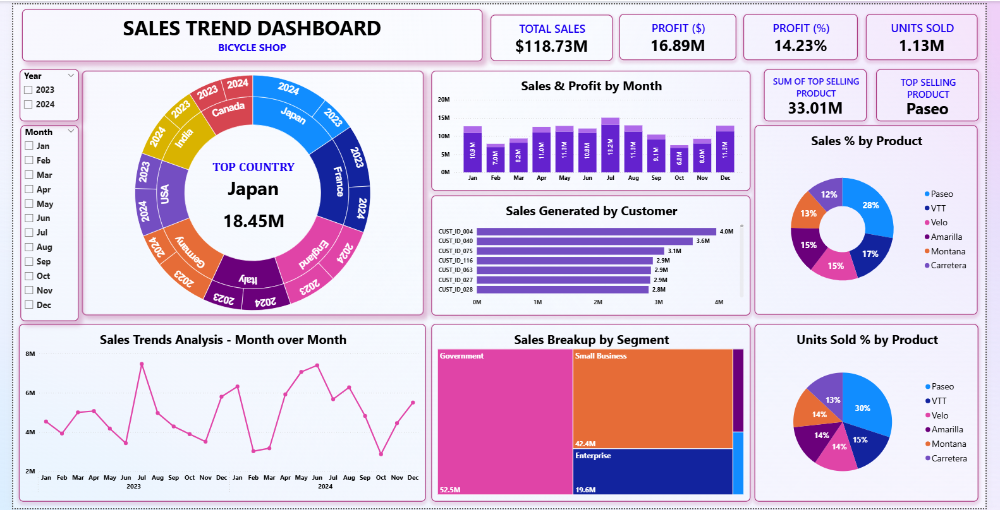

# Sales Trend Analysis Dashboard

## Dashboard Preview

# PROBLEM STATEMENT
The Sales Trend Dashboard helps analyze sales performance, profit, units sold, customer behavior, and product trends across different countries and segments.

 The dashboard provides insights into:

• Total Sales • Total Profit • Profit Percentage • Units Sold • Top Country • Top Selling Product • Monthly Sales Trend

TOOLS USED

• Microsoft Excel • Power Query Editor • Power BI Desktop • DAX

POWER QUERY EDITOR STEPS

Step 1: Load Dataset

Home → Get Data → Excel / CSV → Load

Step 2: Open Power Query Editor

Home → Transform Data

Step 3: Remove Duplicate Rows

Home → Remove Rows → Remove Duplicates

Step 4: Remove Blank Rows

Home → Remove Rows → Remove Blank Rows

Step 5: Change Data Types

Country → Text

Product → Text

Segment → Text

Date → Date

Sales → Decimal Number

Profit → Decimal Number

Units Sold → Whole Number

Step 6: Create Month Number Column

Select Date column.

Add Column → Date → Month → Month

Rename the column:

Month Number

Step 7: Create Month Name Column

Select Date column.

Add Column → Date → Month → Name of Month

Rename the column:

Month Name

Step 8: Extract First 3 Characters of Month Name

Select Month Name column.

Transform → Extract → First Characters

Enter:

3

Example:

January → Jan

February → Feb

March → Mar

April → Apr

May → May

Step 9: Sort Month Name by Month Number

Select Month Name column.

Column Tools → Sort by Column

Choose:

Month Number

Step 10: Close and Apply

Click:

Close & Apply

DAX MEASURES

Total Sales

DAX:

Total Sales = SUM(Sales[Sales])

Total Profit

DAX:

Total Profit = SUM(Sales[Profit])

Units Sold

DAX:

Units Sold = SUM(Sales[Units Sold])

Profit %

DAX:

Profit % = DIVIDE( [Total Profit], [Total Sales], 0 ) * 100

Top Selling Product

DAX:

Top Product = TOPN( 1, VALUES(Sales[Product]), [Total Sales] )

DASHBOARD CREATION STEPS

Step 1: Create Slicers

Create slicers for:

• Year • Month

SNAPSHOT
(slicers.png)

